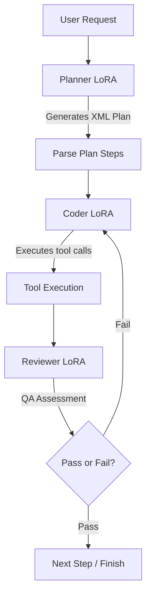

# Local Coding Multi-Agent: Dynamic LoRA Swapping with TRL & PEFT on Consumer Hardware

This tutorial outlines the architectural design and execution details of a local, privacy-first **Coding Multi-Agent system**. The system is built to satisfy a strict hardware constraint: **It must execute comfortably on a consumer GPU with a maximum of 16GB VRAM.**

Instead of loading three separate heavy models, we load a single, quantized base model and hot-swap task-specific LoRA (Low-Rank Adaptation) adapters in milliseconds using Hugging Face **PEFT** and **TRL**, entirely independent of Unsloth.

---

## Part 1: The VRAM Hardware Challenge

Running multiple distinct agents (Planner, Coder, Reviewer) locally normally requires massive GPU resources. Loading three different 9B models simultaneously would consume 30GB+ of VRAM, leading to instant Out-of-Memory (OOM) errors on consumer cards.

To solve this under a strict 16GB budget, we use **Dynamic LoRA Hot-Swapping**:
1. We load a single base model (`unsloth/Qwen3.5-4B` or `Qwen/Qwen3.5-9B`) in 4-bit NF4 quantization using `BitsAndBytesConfig`, which takes only ~3.5GB to ~5.5GB of VRAM.
2. We load the model context for inference using `peft.PeftModel`.
3. As the execution phase transitions (e.g., Planner -> Coder -> Reviewer), we call `model.set_adapter()`. The PEFT library hot-swaps the active LoRA weights in milliseconds.
4. Since LoRA weights are tiny (usually 10MB to 50MB per role), the VRAM footprint remains completely flat throughout execution.

---

## Part 1.5: Architectural Alternatives

Dynamic LoRA swapping is one of several approaches to building local multi-agent systems under hardware constraints:

*   **Sequential Loading and Unloading of Specialized Models:**
    *   *Design:* Load a specialized Planner model into VRAM, execute, delete it from memory, and then load a specialized Coder model.
    *   *Pros:* Allows each agent to run on the absolute best base architecture for its specific task.
    *   *Cons:* Severe latency. Copying 5GB–15GB weights from system RAM to GPU VRAM over PCIe at each turn transition takes several seconds, making the user experience sluggish.
*   **Co-existence of Tiny Models:**
    *   *Design:* Load three smaller models (e.g., 1.5B or 3B parameters) into VRAM side-by-side.
    *   *Pros:* Zero swap latency; all agents are continuously active.
    *   *Cons:* Small parameter size significantly degrades reasoning capacity, instruction-following ability, and JSON output reliability.
*   **Dynamic LoRA Hot-Swapping with TRL/PEFT (Chosen Design):**
    *   *Pros:* Combines the reasoning capabilities of a larger base model with sub-millisecond weight-swapping times and a stable, flat VRAM footprint (~4-6GB).
    *   *Cons:* Forces all agents to share the same underlying base language representation.

---

## Part 2: The Agent CLI (`coding_agent.py`)

The orchestration logic is deployed in `coding_agent.py`. It automates the multi-agent execution loop:



### Robust Plan Parsing
To prevent the agent from executing the LLM's internal thinking process, we instruct the **Planner** role to wrap the final list of executable steps inside `<plan>...</plan>` XML-style tags. The CLI parses only the content within these tags, extracting numbered lines (e.g., `1. Create script.py`).

### CLI Usage
You can run the coding agent directly from the command line:

```bash
# Execute a task
python3 coding_agent.py "Write a python script to download weather data"
```

---

## Part 3: The LoRA Factory (`train_loras.py`)

To train the specialized Planner, Coder, and Reviewer LoRAs, we use the `train_loras.py` script with Hugging Face **TRL** (`SFTTrainer` and `SFTConfig`):

1. **Planner Adapter**: Fine-tuned on reasoning-focused subsets of `Open-Orca/OpenOrca`.
2. **Coder Adapter**: Fine-tuned on Hermes function-calling datasets (`NousResearch/hermes-function-calling-v1`) to master returning valid JSON tool calls.
3. **Reviewer Adapter**: Fine-tuned on `m-a-p/CodeFeedback-Filtered-Instruction` to inspect execution results and output PASS/FAIL assertions.

All models are trained sequentially, unloading the active training adapter at each stage to prevent memory leakage, and can be pushed to Hugging Face Hub.

---

## Part 4: Testing & Verification

We maintain a clean and structured testing setup under the `tests/` directory:

- **`tests/test_env.py`**: A consolidated unit test suite checking PyTorch CUDA availability, Hugging Face dataset mapping capabilities, Transformers, PEFT, BitsAndBytes, and TRL `SFTConfig`.
- **`tests/test_longest_substring.py`**: Dynamic unit tests checking edge cases (empty strings, repetitive sequences, unique strings) for generated algorithms.

To run the full test suite:

```bash
python3 -m unittest discover tests
```
